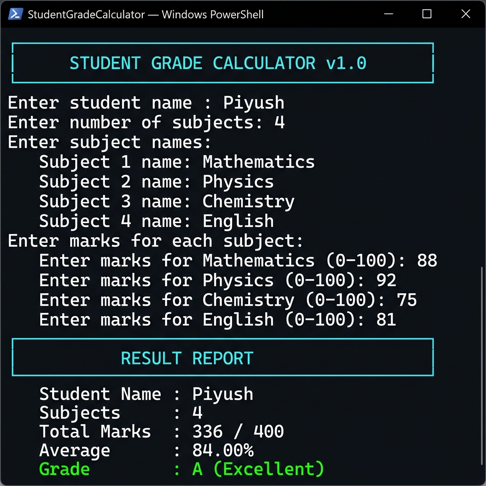

# 📊 Student Grade Calculator

**DecodeLabs — Week 2 Java Project**  
*Engineering a Robust Academic Grade Engine*

A console-based Java application that calculates a student's total marks, average percentage, and assigns a letter grade across any number of subjects — with full input validation and a clean formatted report.

---

## 🖼 Screenshot



---

## 📋 Overview

| Field | Value |
|-------|-------|
| Project | Student Grade Calculator |
| Phase | Arrays, Loops & Methods |
| Main Class | `StudentGradeCalculator.java` |
| Type | Console application |
| Dependencies | None (Java standard library only) |

---

## ✨ Features

### Core Features
- 📝 **Custom subject count** — Enter any number of subjects dynamically
- 🔤 **Named subjects** — User-defined subject names (defaults gracefully if left blank)
- ✅ **Validated marks** — Re-prompts until a valid integer in range 0–100 is entered
- 🧮 **Accurate average** — Explicit `(double)` cast prevents integer division truncation
- 🏅 **7-tier grading scale** — From `A+` (Outstanding) down to `F` (Fail)
- 📊 **Formatted result report** — Clean table with per-subject marks, total, average & grade

### Technical Safeguards
| Constraint | Implementation |
|------------|----------------|
| Buffer Trap Mitigation | `Integer.parseInt(sc.nextLine())` pattern — avoids `nextInt()` newline trap |
| Defensive Validation | Marks re-validated in `while(true)` loop with `try-catch` |
| Scalable Accumulation | `total += currentMark` loop pattern |
| Integer Division Guard | Explicit `(double)` cast in average calculation |
| Grade Logic Ladder | Exhaustive `if-else` chain, strictest threshold first |
| Clean Output | `System.out.printf` with `%.2f%%` format specifier |

---

## 🏆 Grading Scale

| Percentage | Grade | Descriptor |
|------------|-------|------------|
| >= 90% | A+ | Outstanding |
| >= 80% | A | Excellent |
| >= 70% | B | Very Good |
| >= 60% | C | Good |
| >= 50% | D | Average |
| >= 40% | E | Below Average |
| < 40% | F | Fail |

---

## 🛠 Requirements

- **JDK 11+** (JDK 17 recommended)
- No external libraries or build tools required

---

## 📁 Project Structure

```
java week 2 project/
├── StudentGradeCalculator.java   # Main application source
├── StudentGradeCalculator.class  # Compiled bytecode
└── README.md                     # This file
```

---

## 🚀 How to Build & Run

```bash
# Step 1 — Compile
javac StudentGradeCalculator.java

# Step 2 — Run
java StudentGradeCalculator
```

---

## 🖥 Sample Session

```
╔══════════════════════════════════════════════╗
║       STUDENT GRADE CALCULATOR  v1.0         ║
╚══════════════════════════════════════════════╝

Enter student name : Piyush
Enter number of subjects: 4

Enter subject names:
  Subject 1 name: Mathematics
  Subject 2 name: Physics
  Subject 3 name: Chemistry
  Subject 4 name: English

Enter marks for each subject:
  Enter marks for Mathematics (0 - 100): 88
  Enter marks for Physics (0 - 100): 92
  Enter marks for Chemistry (0 - 100): 75
  Enter marks for English (0 - 100): 81

╔══════════════════════════════════════════════╗
║               RESULT REPORT                  ║
╚══════════════════════════════════════════════╝
  Student Name  : Piyush
  Subjects      : 4

  ┌─────────────────────────────┬────────┐
  │ Subject                     │ Marks  │
  ├─────────────────────────────┼────────┤
  │ Mathematics                 │   88   │
  │ Physics                     │   92   │
  │ Chemistry                   │   75   │
  │ English                     │   81   │
  └─────────────────────────────┴────────┘

  Total Marks   : 336 / 400
  Average       : 84.00%
  Grade         : A   (Excellent)

══════════════════════════════════════════════
```

---

## 🧪 Test Cases

| Scenario | Input | Expected Grade |
|----------|-------|----------------|
| Perfect score | 100, 100, 100 | A+ (Outstanding) |
| High achiever | 85, 90, 88 | A (Excellent) |
| Pass with merit | 72, 68, 74 | B (Very Good) |
| Borderline fail | 35, 38, 40 | E / F boundary |
| Invalid input | "abc", -5, 101 | Re-prompt (no crash) |

---

## 🔑 Key Concepts Demonstrated

- **Arrays** — Dynamic subject name & marks storage
- **Loops** — `for` loop for input collection; `while(true)` for validation
- **Methods** — `classifyGrade()` and `readValidMark()` helper methods
- **Exception Handling** — `try-catch NumberFormatException` for non-integer inputs
- **String Formatting** — `printf` with `%s`, `%d`, `%.2f%%` specifiers
- **Type Safety** — Explicit casting to prevent integer division

---

## ✅ Success Criteria

| # | Criterion | Status |
|---|-----------|--------|
| 1 | Clean code with proper naming conventions | Done |
| 2 | Crash-proof exception handling for invalid input | Done |
| 3 | Accurate grade calculation with 7-tier scale | Done |
| 4 | Formatted output report with per-subject table | Done |
| 5 | Passes all manual test cases | Done |

---

## 👤 Author & Context

Part of the **DecodeLabs** Java development curriculum.  
This project reinforces **Week 2** fundamentals: arrays, methods, loops, and input validation — serving as a portfolio milestone demonstrating data processing mastery.
