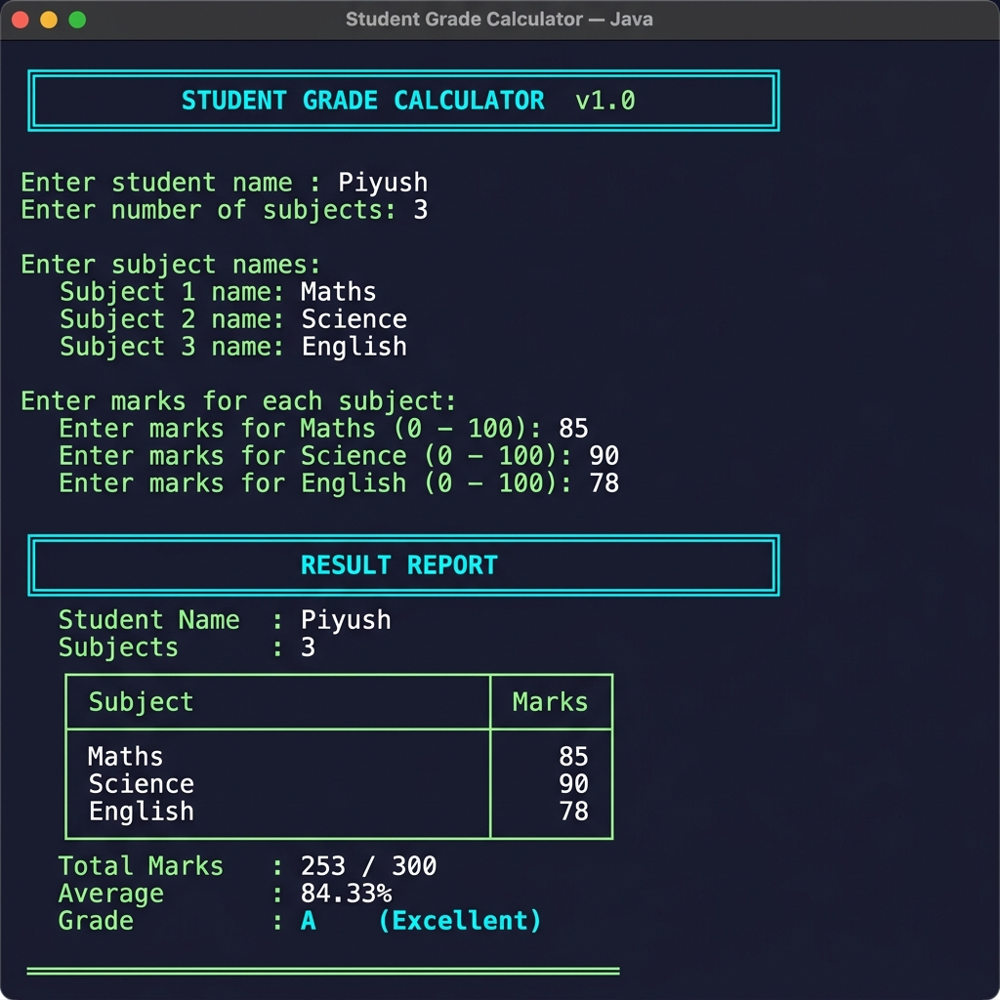

# 📚 Student Grade Calculator — Java Week 2 Project


A console-based Java application that collects marks for multiple subjects, calculates the total score, average percentage, and assigns a letter grade to a student — all with robust input validation.

---

## 🖥️ Sample Output



---

## ✨ Features

| Feature | Description |
|---|---|
| 📝 Dynamic Subjects | Supports any number of subjects entered at runtime |
| ✅ Input Validation | Rejects non-numeric input and out-of-range marks (0–100) |
| 🔢 Grade Ladder | 7-tier grade system from A+ (Outstanding) to F (Fail) |
| 💡 Buffer-Trap Safe | Uses `nextLine()` + `Integer.parseInt()` to avoid Scanner pitfalls |
| 📊 Pretty Table | Formatted ASCII table output for subject-wise marks |
| 🎯 Precise Average | Explicit `double` cast prevents integer division errors |

---

## 🏆 Grade Scale

| Grade | Percentage Range | Remark |
|---|---|---|
| **A+** | 90% – 100% | Outstanding |
| **A** | 80% – 89% | Excellent |
| **B** | 70% – 79% | Very Good |
| **C** | 60% – 69% | Good |
| **D** | 50% – 59% | Average |
| **E** | 40% – 49% | Below Average |
| **F** | Below 40% | Fail |

---

## 🛠️ How to Compile & Run

### Prerequisites
- Java Development Kit (JDK) 8 or above installed
- Terminal / Command Prompt

### Compile
```bash
javac StudentGradeCalculator.java
```

### Run
```bash
java StudentGradeCalculator
```

### Example Session
```
╔══════════════════════════════════════════════╗
║       STUDENT GRADE CALCULATOR  v1.0         ║
╚══════════════════════════════════════════════╝

Enter student name : Piyush
Enter number of subjects: 3

Enter subject names:
  Subject 1 name: Maths
  Subject 2 name: Science
  Subject 3 name: English

Enter marks for each subject:
  Enter marks for Maths (0 – 100): 85
  Enter marks for Science (0 – 100): 90
  Enter marks for English (0 – 100): 78

╔══════════════════════════════════════════════╗
║               RESULT REPORT                  ║
╚══════════════════════════════════════════════╝
  Student Name  : Piyush
  Subjects      : 3

  ┌─────────────────────────────┬────────┐
  │ Subject                     │ Marks  │
  ├─────────────────────────────┼────────┤
  │ Maths                       │   85   │
  │ Science                     │   90   │
  │ English                     │   78   │
  └─────────────────────────────┴────────┘

  Total Marks   : 253 / 300
  Average       : 84.33%
  Grade         : A   (Excellent)

══════════════════════════════════════════════
```

---

## 🔬 Technical Constraints Applied

The code carefully applies these defensive programming techniques:

1. **Buffer Trap Mitigation** — `Integer.parseInt(sc.nextLine())` pattern used throughout to avoid `Scanner` skipping issues after `nextInt()`.

2. **Defensive Validation** — Marks are validated in the range `0–100` before being accumulated. Invalid input triggers a re-prompt.

3. **Scalable Accumulation** — `total += currentMark` loop pattern supports any number of subjects without changing logic.

4. **Integer Division Guard** — Explicit `(double)` cast during average calculation prevents truncation:
   ```java
   double average = (double) total / numSubjects;
   ```

5. **Grade Logic Ladder** — Exhaustive `if-else` chain with strictest condition (`>= 90`) checked first.

6. **Clean Output Formatting** — `System.out.printf("%.2f%%", average)` for precise 2-decimal percentage display.

---

## 📁 Project Structure

```
java week 2 project/
├── StudentGradeCalculator.java   # Main source file
├── StudentGradeCalculator.class  # Compiled bytecode (gitignored)
├── .gitignore                    # Ignores .class and IDE files
├── README.md                     # This file
└── docs/
    └── sample_output.png         # Terminal screenshot
```

---

## 👤 Author

**Piyush** — Java Week 2 Project Submission

---

*Built with ❤️ as part of the Java learning journey.*
